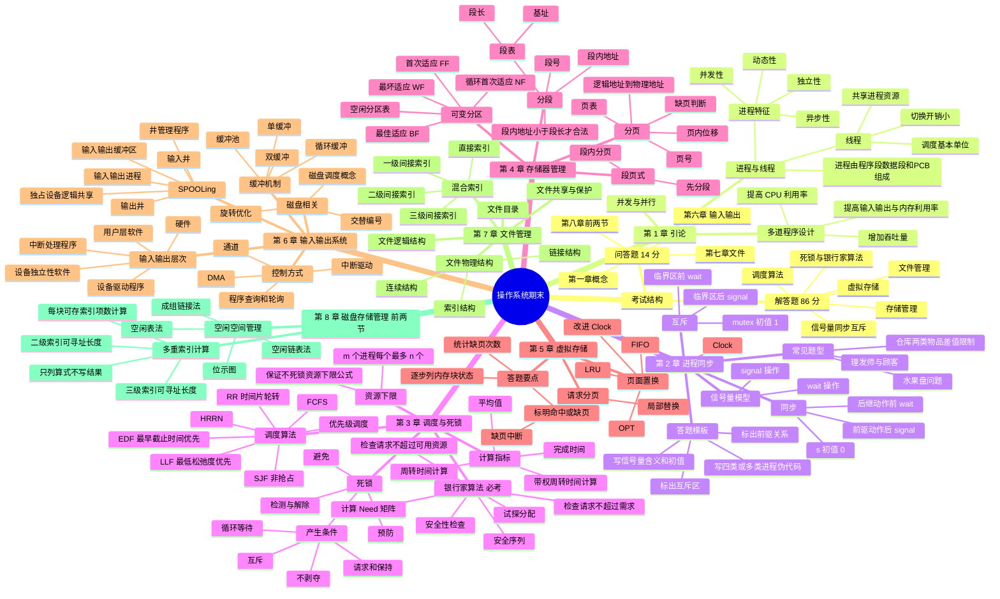

---
tags:
  - 操作系统
  - 期末复习
  - 思维导图
created: 2026-06-20
---

# 操作系统期末复习思维导图

> 范围按老师划线整理：第 1 章到第 8 章前两节。考试以解答题为主：解答题约 86 分，问答题约 14 分。

## 冲刺顺序

1. 先练银行家算法和 PV 信号量，这是最高确定性的综合题。
2. 再练调度算法、可变分区、分页/分段地址转换、页面置换。
3. 最后背第 1、6、7、8 章简答题模板。
