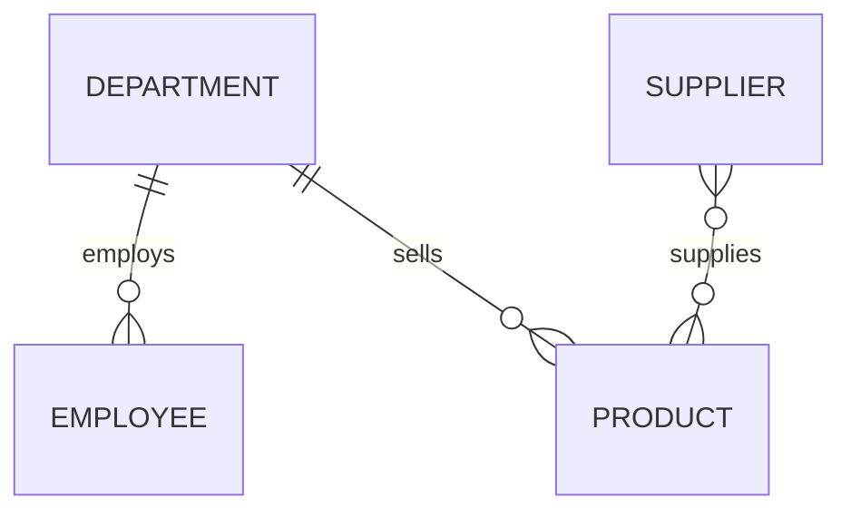

# 2024-2025 数据库原理期末试卷及参考答案

> 原题来源：2024-2025 数据库原理期末试卷(2).pdf

## 原题整理

```text
# 2024-2025 数据库原理期末试卷(2).pdf
页数: 7


--- page 1 ---
2024/2025 学年 第 二 学期
课程代码：12002231 课程名称：数据库原理（双语） 试卷：A ■
考试形式：开卷 □ 闭卷 ■ 考试时间： 120 分钟
学号： 姓名： 任课老师： 专业： 得分：
Question 1.
Given the following relational schema:
* Student (Sno, Sname, Sex, Age)
* Course (Cno, Cname, Teacher)
* SC (Sno, Cno, Grade)
Please write the Relational Algebra expressions for the following queries:
1. Find the student numbers (Sno) and names (Sname) of students who have enrolled in the ’Mathe-
matics’ course.
2. Find the student numbers (Sno) of students who have taken courses taught by teacher ’Cheng Jun’.
3. Find the student numbers (Sno) of students who have enrolled in both course ’1’ and course ’3’.
4. Find the student numbers (Sno) of students who have enrolled in either ’Database Principles’ or
’Operating Systems’.
5. Find the student numbers (Sno), names (Sname), and ages (Age) of female students aged between
18 and 20 (inclusive).
6. Find the names (Sname) of students who have enrolled in all available courses.
7. Find the student numbers (Sno) of students who have enrolled in all courses that student ’1042’
has enrolled in.
1


--- page 2 ---
第一题：
已知如下关系模式：
* 学生 S (Sno 学号, Sname 学生姓名, Sex 性别, Age 年龄)
* 课程 C (Cno 课程代码, Cname 课程名称, Teacher 授课教师)
* 选课 SC (Sno 学号, Cno 课程代码, Grade 成绩)
请写出下列查询的关系代数表达式：
1. 查询选修了” 数学” 课程的学生学号和姓名。
2. 查询选修了” 程军” 老师课程的学生学号。
3. 查询至少选修了课程号为’1’ 与’3’ 的课程的学生学号。
4. 查询选修了” 数据库原理” 或” 操作系统” 的学生的学号。
5. 查询年龄在 [18, 20] 之间的女学生的学号、姓名、年龄。
6. 查询选修了全部课程的学生姓名。
7. 查询选修了’1042’ 号同学选修的全部课程的学生的学号。
2


--- page 3 ---
Question 2.
Given the following background:
* Employee (EmpNo, Ename, Sex, Age)
* Club (ClubNo, Cname, Manager, Location)
* Participate (EmpNo, ClubNo, PDate)
Please write the SQL statements to complete the following tasks:
1. Write the CREATE TABLE statements for the three tables. Clearly specify the primary keys and
foreign keys (e.g., Manager references EmpNo, and Participate contains foreign keys referencing the other
two tables).
2. Create the following two views:
* Manager_Details: displaying ClubNo, Cname, ManagerName, and ManagerSex.
* Participation_Details: displaying EmpNo, Ename, ClubNo, Cname, and PDate.
3. Find the employee numbers (EmpNo) of employees who participate in either the ’Basketball’ club
or the ’Dance’ club.
4. Find the details (all attributes) of employees who do not participate in any club.
5. Find the details (all attributes) of employees who participate in all available clubs.
6. Find the employee numbers (EmpNo) of all employees who participate in at least one club that
employee ’1001’ participates in.
7. Find the total number of participating employees for each club.
第二题：
已知如下业务背景：
* 职工（职工号，姓名，性别，年龄）
* 社团（编号，名称，负责人，活动地点）
* 参加（职工号，编号，参加日期）
请写出完成下列任务的 SQL 语句：
1. 写出这三张表的 CREATE TABLE 建表语句，并明确定义主键和外键约束（提示：社团的
负责人应参照职工号；参加表为关联表，需定义对应外键）。
2. 创建以下两个视图：
* 负责人详情视图（社团编号，名称，负责人姓名，负责人性别）。
* 参加人员详情视图（职工号，姓名，社团编号，社团名称，参加日期）。
3. 查询参加了” 篮球社” 或” 舞蹈团” 的职工号。
3


--- page 4 ---
4. 查询没有参加任何社团的职工详情（所有属性）。
5. 查询参加了全部社团的职工详情（所有属性）。
6. 查询与’1001’ 号职工一起参加过社团的所有职工的职工号（即该职工参加的社团中，包含
至少一个’1001’ 号职工参加的社团）。
7. 查询每个社团有多少人参加。
4


--- page 5 ---
Question 3.
Given a universal relation
R(studentID, studentName, courseID, teacherName, officeName, grade) and the following business
rules:
* A student can choose multiple courses, and a course can be chosen by multiple students.
* A student has exactly one grade for a specific course.
* A course is taught by exactly one teacher. A teacher is assigned to exactly one office, and offices
are not shared among teachers.
Please answer the following questions:
1. Write down all the non-trivial Functional Dependencies (FDs) and identify the Candidate Key(s)
for relation R.
2. What is the highest Normal Form (NF) that relation R satisfies? Explain your reasoning.
3. If relation R is not in 3NF, decompose it into a set of 3NF relations. Ensure a lossless-join and
dependency-preserving decomposition.
第三题：
给定全局关系模式
R(studentID, studentName, courseID, teacherName, officeName, grade) 以及如下业务规则：
* 一个学生可以选择多门课程，一门课程可以被多名学生选修。
* 一个学生在一门课上只有一个成绩。
* 一门课程只能被一个教师授课；一个教师只能拥有一间办公室，且办公室不重复分配。
请回答以下问题：
1. 写出该关系模式中存在的所有非平凡函数依赖，并指出其候选键。
2. 该关系模式满足的最高范式是什么？请说明理由。
3. 如果该关系模式不满足 3NF（第三范式），请将其分解为满足 3NF 的关系模式集合。
5


--- page 6 ---
Question 4.
A company database needs to manage Employees, Departments, Products, and Suppliers based on the
following rules:
* An employee belongs to exactly one department, but a department can have multiple employees.
* A department can sell multiple products, but a specific product is sold in exactly one department.
* A supplier can supply multiple products, and a specific product can be supplied by multiple
suppliers.
* The system needs to track the ”Sales Quantity” of products and the ”Supply Quantity” from
suppliers.
Please complete the following tasks:
1. Draw the E-R Diagram for this system (supplement necessary attributes such as IDs and names
for entities, and ensure cardinalities like 1:N or M:N are clearly marked).
2. Convert the E-R diagram into a Relational Model.
3. Write out the Relational Schemas. Use a solid underline (___) to indicate Primary Keys, and a
wavy underline ( ) to indicate Foreign Keys.
第四题：
某公司数据库需要管理职工、部门、商品和供应商，存在以下业务规则：
* 一个职工只能在一个部门工作，一个部门可以有多名职工。
* 一个部门可以售卖多种商品，一种商品只能在一个指定的部门售卖。
* 一个供应商可以供应多种商品，一种商品也可以由多个供应商供应。
* 系统需要统计商品的” 售卖数量” 以及供应商的” 供应数量”。
请完成以下任务：
1. 画出该系统的 E-R 图（请自行补充实体必要的属性，如编号、名称等，并标明 1:N 或 M:N
类型的联系）。
2. 将该 E-R 图转换为关系模型。
3. 写出转换后的关系模式，并明确标出主键和外键（要求：主键用直线 ___ 标出，外键用波
浪线 标出）。
6


--- page 7 ---
Question 5.
Given the following tables in a database: emp(emp0, ..., salary) and dept(deptno, ...). Write the SQL
statements to enforce the following security policies:
1. Grant user WangMing the privilege to SELECT from both tables.
2. Grant user LiuXing the privilege to INSERT and DELETE records in both tables.
3. Ensure that employees can only query their own records (Hint: Standard SQL privilege manage-
ment using Views).
4. Grant user LiuXing the privilege to SELECT from the emp table, and the privilege to UPDATE
only the salary attribute in the emp table.
5. Grant user WangMing all privileges on both tables, and allow him to pass these privileges to other
users.
第五题：
已知数据库中存在表 emp(emp0, ..., salary) 和 dept(deptno, ...)。请写出实现以下安全性控制的
SQL 语句：
1. 授予用户 WangMing 对这两张表的查询（SELECT）权限。
2. 授予用户 LiuXing 对这两张表的插入（INSERT）和删除（DELETE）权限。
3. 实现员工只能查询属于自己的记录的数据权限控制（提示：请结合视图 View 机制实现）。
4. 授予用户 LiuXing 对 emp 表的查询权限，以及对 emp 表中 salary 字段的修改（UPDATE）
权限。
5. 授予用户 WangMing 对这两张表的全部权限（ALL PRIVILEGES），并允许他将这些权限
继续转授（再分配）给其他用户。
7
```
# 参考答案

## Question 1：关系代数

1）选修“数学”课程的学生学号和姓名：

```text
π Sno,Sname ( Student ⋈ SC ⋈ σ Cname='Mathematics'(Course) )
```

2）选修“程军”老师课程的学生学号：

```text
π Sno ( SC ⋈ SC.Cno=Course.Cno σ Teacher='Cheng Jun'(Course) )
```

3）至少选修课程号为 1 与 3 的学生学号：

```text
π Sno(σ Cno='1'(SC)) ∩ π Sno(σ Cno='3'(SC))
```

4）选修“数据库原理”或“操作系统”的学生学号：

```text
π Sno ( SC ⋈ SC.Cno=Course.Cno σ Cname='Database Principles' ∨ Cname='Operating Systems'(Course) )
```

5）年龄 18 到 20 的女学生：

```text
π Sno,Sname,Age ( σ Sex='女' ∧ Age>=18 ∧ Age<=20 (Student) )
```

6）选修全部课程的学生姓名：

```text
π Sname ( Student ⋈ (π Sno,Cno(SC) ÷ π Cno(Course)) )
```

7）选修了 1042 号同学所选全部课程的学生学号：

```text
π Sno,Cno(SC) ÷ π Cno(σ Sno='1042'(SC))
```

若不想包含 1042 本人，可再减去 1042。

## Question 2：SQL

1）建表：

```sql
CREATE TABLE Employee (
  EmpNo CHAR(10) PRIMARY KEY,
  Ename VARCHAR(50) NOT NULL,
  Sex CHAR(2),
  Age INT
);

CREATE TABLE Club (
  ClubNo CHAR(10) PRIMARY KEY,
  Cname VARCHAR(50) NOT NULL,
  Manager CHAR(10),
  Location VARCHAR(100),
  FOREIGN KEY (Manager) REFERENCES Employee(EmpNo)
);

CREATE TABLE Participate (
  EmpNo CHAR(10),
  ClubNo CHAR(10),
  PDate DATE,
  PRIMARY KEY (EmpNo, ClubNo),
  FOREIGN KEY (EmpNo) REFERENCES Employee(EmpNo),
  FOREIGN KEY (ClubNo) REFERENCES Club(ClubNo)
);
```

2）视图：

```sql
CREATE VIEW Manager_Details AS
SELECT c.ClubNo, c.Cname, e.Ename AS ManagerName, e.Sex AS ManagerSex
FROM Club c
JOIN Employee e ON c.Manager = e.EmpNo;

CREATE VIEW Participation_Details AS
SELECT e.EmpNo, e.Ename, c.ClubNo, c.Cname, p.PDate
FROM Participate p
JOIN Employee e ON p.EmpNo = e.EmpNo
JOIN Club c ON p.ClubNo = c.ClubNo;
```

3）参加篮球社或舞蹈团：

```sql
SELECT DISTINCT p.EmpNo
FROM Participate p
JOIN Club c ON p.ClubNo = c.ClubNo
WHERE c.Cname IN ('篮球社', '舞蹈团');
```

4）没有参加任何社团：

```sql
SELECT e.*
FROM Employee e
WHERE NOT EXISTS (
  SELECT 1 FROM Participate p WHERE p.EmpNo = e.EmpNo
);
```

5）参加全部社团：

```sql
SELECT e.*
FROM Employee e
WHERE NOT EXISTS (
  SELECT 1
  FROM Club c
  WHERE NOT EXISTS (
    SELECT 1
    FROM Participate p
    WHERE p.EmpNo = e.EmpNo AND p.ClubNo = c.ClubNo
  )
);
```

6）与 1001 号职工至少参加过一个相同社团：

```sql
SELECT DISTINCT p.EmpNo
FROM Participate p
WHERE p.ClubNo IN (
  SELECT ClubNo FROM Participate WHERE EmpNo = '1001'
);
```

若排除本人，加 `p.EmpNo <> '1001'`。

7）每个社团人数：

```sql
SELECT c.ClubNo, c.Cname, COUNT(p.EmpNo) AS MemberCount
FROM Club c
LEFT JOIN Participate p ON c.ClubNo = p.ClubNo
GROUP BY c.ClubNo, c.Cname;
```

## Question 3：函数依赖与范式

非平凡函数依赖：

```text
studentID -> studentName
courseID -> teacherName
teacherName -> officeName
officeName -> teacherName
(studentID, courseID) -> grade
courseID -> officeName
```

候选键：`(studentID, courseID)`。

最高范式：1NF，不满足 2NF。因为存在对复合候选键的部分函数依赖，如 `studentID -> studentName`、`courseID -> teacherName`。

3NF 分解：

```text
Student(studentID, studentName)
Course(courseID, teacherName)
TeacherOffice(teacherName, officeName)
SC(studentID, courseID, grade)
```

TeacherOffice 中 officeName 可设唯一约束。该分解保持依赖并可无损连接。

## Question 4：E-R 图与关系模型

实体：

```text
Employee(EmpID, EmpName, Sex, Age)
Department(DeptID, DeptName)
Product(ProductID, ProductName, SalesQuantity)
Supplier(SupplierID, SupplierName, Tel)
```

联系：

```text
Department 1:N Employee
Department 1:N Product
Supplier M:N Product，联系属性 SupplyQuantity
```



关系模式：

```text
Department(___DeptID___, DeptName)
Employee(___EmpID___, EmpName, Sex, Age, ~~~DeptID~~~)
Product(___ProductID___, ProductName, SalesQuantity, ~~~DeptID~~~)
Supplier(___SupplierID___, SupplierName, Tel)
Supply(___~~~SupplierID~~~___, ___~~~ProductID~~~___, SupplyQuantity)
```

Supply 的主键为 `(SupplierID, ProductID)`，两者也是外键。

## Question 5：数据库安全性 SQL

1）授予 WangMing 查询权限：

```sql
GRANT SELECT ON emp TO WangMing;
GRANT SELECT ON dept TO WangMing;
```

2）授予 LiuXing 插入和删除权限：

```sql
GRANT INSERT, DELETE ON emp TO LiuXing;
GRANT INSERT, DELETE ON dept TO LiuXing;
```

3）员工只能查询自己的记录：

```sql
CREATE VIEW emp_self AS
SELECT *
FROM emp
WHERE username = CURRENT_USER;

GRANT SELECT ON emp_self TO PUBLIC;
```

若以 empno 对应数据库用户名，可写 `WHERE empno = CURRENT_USER`。关键是普通员工不要直接拥有 emp 基表查询权限。

4）授予 LiuXing 查询 emp 和修改 salary：

```sql
GRANT SELECT ON emp TO LiuXing;
GRANT UPDATE (salary) ON emp TO LiuXing;
```

5）授予 WangMing 全部权限并允许转授：

```sql
GRANT ALL PRIVILEGES ON emp TO WangMing WITH GRANT OPTION;
GRANT ALL PRIVILEGES ON dept TO WangMing WITH GRANT OPTION;
```

