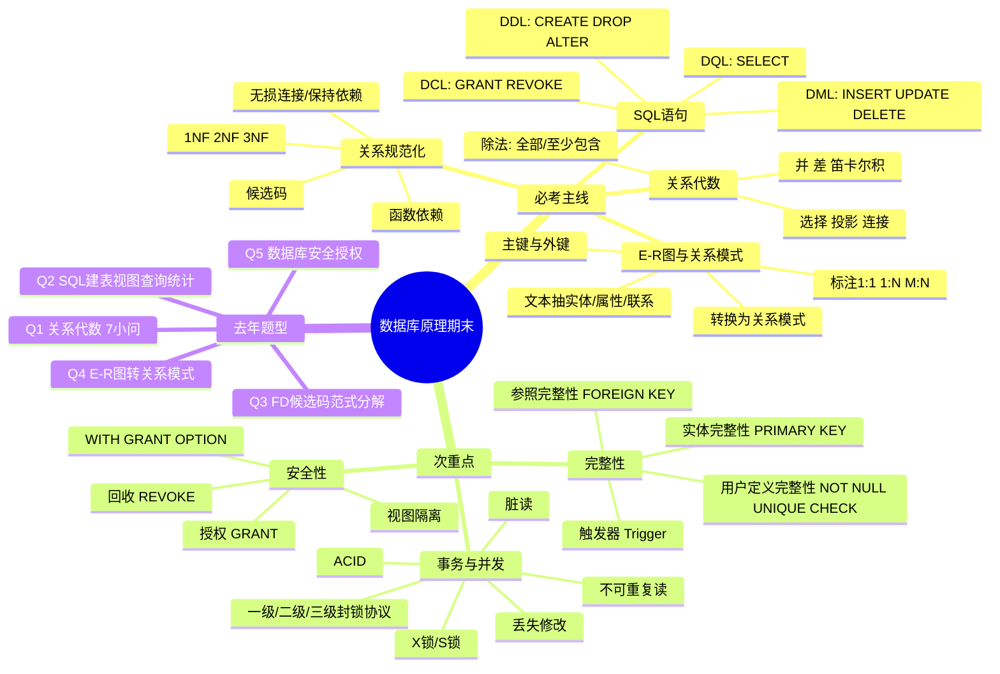

# 数据库原理期末复习思维导图

> 来源交叉：老师四张标注图 + 两份同学资料 + 2024-2025 回忆版试卷。考试为闭卷 120 分钟，全部解答题，约 40% 英文题干；建议中文作答但记住核心英文术语。



## 一、优先级地图

| 优先级 | 内容 | 为什么重要 | 复习产出 |
|---|---|---|---|
| S | SQL 查询与定义 | 老师图、同学资料、去年卷共同高频 | 能手写 `CREATE TABLE`、视图、连接、嵌套、分组、`NOT EXISTS`/除法语义 |
| S | E-R 图与关系模式转换 | 老师明确写“画 E-R 图、给关系模式、满足几级范式、如何改进” | 能从文字提取实体、属性、联系，标 1:1/1:N/M:N，并写 PK/FK |
| A | 函数依赖与 1NF/2NF/3NF | 资料称全书最难，去年第 3 题完整考 | 会找 FD、候选码、最高范式、3NF 分解 |
| A | 关系代数 | 老师图圈第 2 章，去年第 1 题全英文 | 会写选择、投影、连接、并/交/差、除法 |
| B | 安全性与完整性 | 去年考授权，老师图圈完整性/触发器 | 会写 `GRANT`/`REVOKE`、PK/FK/CHECK、触发器框架 |
| B | 事务并发 | 老师图标 ACID、封锁协议 | 会解释 ACID、并发异常、X/S 锁与三级封锁协议 |

## 二、SQL 核心模板

### 1. 建表与约束

```sql
CREATE TABLE 表名 (
  属性名 类型 [NOT NULL] [UNIQUE],
  ...,
  PRIMARY KEY (主键属性),
  FOREIGN KEY (外键属性) REFERENCES 被参照表(主键属性),
  CHECK (条件)
);
```

易错点：复合主键必须写表级约束；外键引用的是被参照表的候选码/主键；`CHECK` 可用于列级或表级约束。

### 2. 查询模板

```sql
SELECT [DISTINCT] 目标列
FROM 表1 [JOIN 表2 ON 连接条件]
WHERE 行条件
GROUP BY 分组列
HAVING 组条件
ORDER BY 排序列 ASC|DESC;
```

高频题眼：

- “没有参加/没有选修”：`NOT EXISTS` 或 `LEFT JOIN ... IS NULL`
- “参加全部/选修全部”：双重 `NOT EXISTS`
- “至少参加一个同某人参加的”：`IN (SELECT ...)`
- “每个社团多少人”：`GROUP BY` + `COUNT(DISTINCT ...)`

### 3. 安全控制

```sql
GRANT SELECT ON emp TO WangMing;
GRANT INSERT, DELETE ON emp TO LiuXing;
GRANT UPDATE(salary) ON emp TO LiuXing;
GRANT ALL PRIVILEGES ON emp TO WangMing WITH GRANT OPTION;
REVOKE SELECT ON emp FROM WangMing CASCADE;
```

员工只能查自己记录：先建只含本人记录的视图，再把视图查询权授予对应用户。标准 SQL 中可用 `CURRENT_USER` 表示当前用户。

## 三、E-R 图与关系模式

### 1. 画图步骤

1. 找名词作候选实体：学生、课程、员工、部门、商品、供应商。
2. 找可描述实体的词作属性：编号、姓名、名称、年龄、地点。
3. 找动词/业务关系作联系：选修、属于、销售、供应。
4. 判断基数：1:1、1:N、M:N。
5. 如果联系有自己的属性，如数量、日期、成绩，优先放在联系上。

### 2. 转换规则

- 实体：每个实体转一个关系模式，实体码作主键。
- 1:1 联系：可独立成表，也可并入任一端；并入时加入对方主键作外键和联系属性。
- 1:N 联系：通常并入 N 端；N 端加入 1 端主键作外键和联系属性。
- M:N 联系：必须独立成表；两端主键共同作复合主键，同时分别作外键；联系属性放入该表。

## 四、函数依赖与范式

### 1. 概念链

- 函数依赖 FD：若任意两个元组 X 相同则 Y 必相同，记为 `X -> Y`。
- 非平凡依赖：`Y` 不是 `X` 的子集。
- 完全函数依赖：`X -> Y` 且 X 的任何真子集都不能决定 Y。
- 部分依赖：候选码的一部分即可决定非主属性。
- 传递依赖：`X -> Y`，`Y -> Z`，且 Y 不能反向决定 X，则 Z 传递依赖于 X。
- 候选码：能完全决定全部属性的最小属性集。

### 2. 范式判断口诀

- 1NF：属性不可再分。
- 2NF：在 1NF 基础上，非主属性完全依赖于每一个候选码；主要防部分依赖。
- 3NF：在 2NF 基础上，非主属性不传递依赖于候选码；主要防传递依赖。

典型例：`R(studentID, studentName, courseID, teacherName, officeName, grade)`  
FD：`studentID -> studentName`，`courseID -> teacherName`，`teacherName -> officeName`，`(studentID, courseID) -> grade`。  
候选码：`(studentID, courseID)`。  
最高范式：1NF，不满足 2NF，因为 `studentName`、`teacherName` 对复合码存在部分依赖。  
3NF 分解：Student(studentID, studentName)，Course(courseID, teacherName)，Teacher(teacherName, officeName)，SC(studentID, courseID, grade)。

## 五、关系代数

常用符号：选择 `σ`，投影 `π`，连接 `⨝`，并 `∪`，差 `−`，笛卡尔积 `×`，除法 `÷`。

题眼转换：

- “满足条件的行”：`σ条件(R)`
- “只要某些列”：`π属性(R)`
- “两表按键关联”：`R ⨝条件 S`
- “同时选 A 和 B”：两个集合求交，或自连接。
- “选修全部课程”：`πSno,Cno(SC) ÷ πCno(Course)`
- “包含 1042 选过的全部课”：`πSno,Cno(SC) ÷ πCno(σSno='1042'(SC))`

## 六、完整性、触发器、安全

完整性：

- 实体完整性：主键唯一且非空。
- 参照完整性：外键值要么为空，要么等于被参照表某主键值。
- 用户定义完整性：`NOT NULL`、`UNIQUE`、`CHECK`。

触发器框架：

```sql
CREATE TRIGGER 触发器名
BEFORE|AFTER INSERT|UPDATE|DELETE ON 表名
REFERENCING NEW|OLD ROW AS 变量
FOR EACH ROW
WHEN (条件)
BEGIN
  动作语句;
END;
```

## 七、事务与并发

ACID：

- Atomicity 原子性：要么全做，要么全不做。
- Consistency 一致性：事务前后数据库满足约束。
- Isolation 隔离性：并发事务互不干扰。
- Durability 持续性：提交后的修改永久保存。

并发异常：

- 丢失修改：两个事务改同一数据，后提交覆盖先提交。
- 脏读：读到别的事务未提交、后来又回滚的数据。
- 不可重复读：同一事务两次读同一数据，中间被其他事务修改。

封锁协议：

- X 锁/写锁：加锁事务可读写，其他事务不能再加 S/X 锁。
- S 锁/读锁：多个事务可读，但不能写。
- 一级封锁协议：修改前加 X 锁到事务结束，防丢失修改。
- 二级封锁协议：一级 + 读前加 S 锁读完释放，防脏读。
- 三级封锁协议：一级 + 读前加 S 锁到事务结束，防不可重复读。

## 八、两个 Word 资料疑似错误/需修正

1. “结构化查询语言（tructured query language, SQL）”少了首字母，应为 `Structured Query Language`。
2. `CRATE TRIGGER` 应为 `CREATE TRIGGER`。
3. `JOIN` 的说明中“列名字段类型必须可以比较”表述可保留，但自然连接更准确地说是按同名属性等值连接并去掉重复同名列。
4. 参照完整性处写到“当主键仅有单个属性组成时，这个属性不能再充当外键引用其他表”，这个说法不严谨。一个属性完全可以既是本表主键又是外键，例如弱实体或 1:1 扩展表。应改为：外键必须引用被参照表的候选码/主键，是否同时作为本表主键取决于业务约束。
5. `CREATE VIEW <视图名> [全部列名]` 更规范写法是 `CREATE VIEW 视图名 [(列名列表)] AS 子查询 [WITH CHECK OPTION];`，列名列表可以省略，也可以部分 DBMS 要求与查询列数一致。
6. 范式资料中“3NF：如果 R 属于 1NF，且不存在非主属性对码的传递依赖”作为教材简化版可以用，但考试论证时建议先说明已满足 2NF，再说明无传递依赖。
7. 事务定义语句写作 `BEGIN TRANSACTION; ... COMMIT; ROLLBACK;` 容易误导。实际一个事务结束时二选一：成功 `COMMIT`，失败 `ROLLBACK`，不是两个都写。
8. `Non-trival` 拼写应为 `Non-trivial`。
9. “第十二章：并发操作导致的数据不一致性”资料只列了三类，教材有时还会列“读脏数据/不可重复读/幻读”等，若老师只强调三类按资料掌握即可；若题目出现插入导致集合结果变化，要识别为幻读。

## 九、考前刷题顺序

1. 先刷 SQL：建表、视图、连接、嵌套、全部/不存在、分组统计。
2. 再刷 E-R：从文字画图，再转关系模式。
3. 然后刷范式：FD、候选码、最高范式、3NF 分解。
4. 最后背概念：ACID、并发异常、三级封锁、GRANT/REVOKE、完整性。
