# 计算机组成期末复习思维导图

> 白板版见：[[计算机组成期末复习白板.canvas]]。本页用于 Obsidian 普通 Markdown 查看和搜索。

```mermaid
flowchart TD
  R[计算机组成期末复习]
  R --> A[A级：去年卷和作业高频]
  R --> B[B级：章节核心概念]
  R --> C[答题能力]

  A --> A1[存储器扩展与片选译码]
  A1 --> A11[位扩展：并联扩数据位]
  A1 --> A12[字扩展：译码扩地址范围]
  A1 --> A13[字节编址下地址范围按字节算]

  A --> A2[Cache]
  A2 --> A21[全相联：Tag + 块内地址]
  A2 --> A22[组相联：Tag + 组号 + 块内地址]
  A2 --> A23[命中率、平均访问时间、效率]

  A --> A3[中断系统]
  A3 --> A31[检查时刻：指令结束]
  A3 --> A32[响应条件：允许、未屏蔽、判优通过]
  A3 --> A33[多重中断：屏蔽字和运行轨迹]

  A --> A4[DMA]
  A4 --> A41[AR、WC、DAR、控制寄存器]
  A4 --> A42[预处理、传送、后处理]
  A4 --> A43[地址递增、计数结束、中断通知]

  A --> A5[运算方法]
  A5 --> A51[原码、反码、补码、移码]
  A5 --> A52[补码加减与溢出]
  A5 --> A53[IEEE754单精度]
  A5 --> A54[浮点加减：对阶、求和、规格化]

  A --> A6[指令系统]
  A6 --> A61[指令格式：OP + 地址码]
  A6 --> A62[立即、直接、间接、相对、变址、基址]
  A6 --> A63[有效地址EA计算]

  A --> A7[流水线]
  A7 --> A71[冲突：结构、数据、控制]
  A7 --> A72[时空图]
  A7 --> A73[总时间、吞吐率、加速比]

  A --> A8[控制单元]
  A8 --> A81[取指周期微操作]
  A8 --> A82[间址/执行/中断周期]
  A8 --> A83[组合逻辑 vs 微程序]

  B --> B1[第1章 系统概述：冯诺依曼、层次结构、性能指标]
  B --> B2[第3章 系统总线：分类、结构、控制、通信]
  B --> B3[第4章 存储器：层次、主存、Cache、辅存]
  B --> B4[第5章 I/O：接口、查询、中断、DMA]
  B --> B5[第6章 运算：机器数、定点、浮点、ALU]
  B --> B6[第7章 指令：寻址、RISC/CISC]
  B --> B7[第8章 CPU：寄存器、指令周期、流水、中断]
  B --> B8[第9-10章 控制单元：微操作、节拍、控制器设计]

  C --> C1[计算题：写公式、代入、单位]
  C --> C2[过程题：按时间顺序写]
  C --> C3[比较题：表格分维度]
  C --> C4[画图题：线名、字段、信号标清]
```

## 一页速背

- 存储扩展：先位扩展，再字扩展；低位接芯片内部地址，高位进译码器生成片选。
- Cache：先算主存地址位数、块内位数、Cache行数、组数，再分 Tag/Index/Offset。
- 中断：指令结束检查；允许中断且未屏蔽才响应；多重中断靠屏蔽字改处理优先级。
- DMA：CPU 只做预处理和后处理，数据块传送由 DMA 控制器直接在 I/O 与主存间完成。
- IEEE754：符号位 1 位，阶码 8 位偏置 127，尾数 23 位隐藏最高有效 1。
- 流水线：Delta t 取最慢段；n 条 k 段总时间 (k+n-1)Delta t。
- 控制单元：取指、间址、执行、中断四周期；存数指令执行周期是 Ad(IR)->MAR, 1->W, AC->MDR, MDR->M(MAR)。
